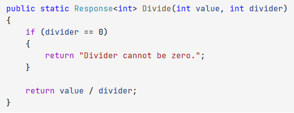

# Functional Programing in c#

Response<TValue>
==============

'Response<TValue>' is a simple class (monad) that contains value or errors.

Here is a simple usage return error. Usage for validation methods.

Combine methods by using then expression

Usage of pipe

My best practice in functional programing
-----------------------------------------

- Avoid mutable states

- Avoid side effect

- Methods should be pure

- Write code in declerative style

- Seperate processed data and methods

- Write for humans not machines

- Use inline methods for reduce parameter passing problems

- if method is too complex then seperate flow into a pipe method so you can read main code block more clearly. No need to compile codes in your brain.

- Do not pass any monad as parameter to another method.